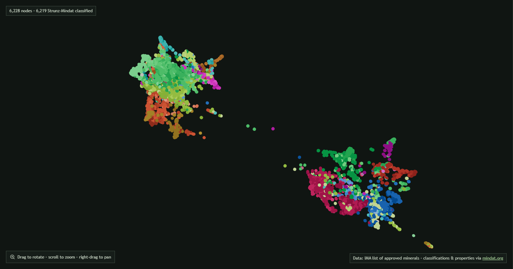
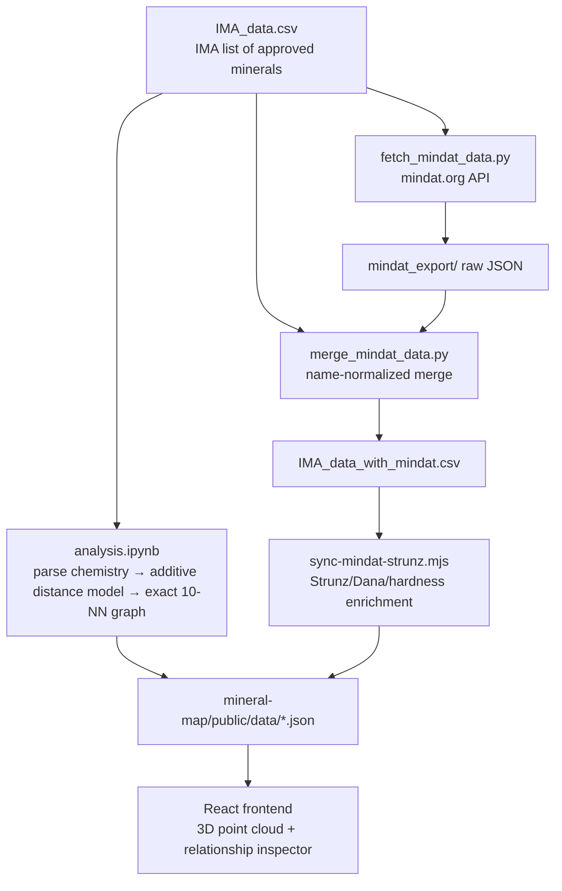

# IMA Mineral Map

An interactive 3D visualization of all [IMA](https://ima-minerals.org/)-approved minerals, arranged in 3D space so that compositionally similar minerals sit close together. Every mineral is linked to its ten nearest compositional neighbours, and each link is broken down into six weighted distance components (anion group, cations, extra anions, hydration, structural water, crystal-structure proxy) that explain *why* two minerals are similar.



## Features

- **6,228 minerals** rendered as an interactive 3D point cloud (React + three.js)
- **Colour modes**: Strunz–Mindat class, Dana 8 class, element highlight, publication-year gradient, hardness gradient
- **Relationship graph**: view the k-NN links (k = 1–10) for a selected mineral or all edges at once
- **Relationship inspector**: every neighbour link is categorized (polymorph, hydration variant, redox variant, cation analogue, …) and decomposed into its six weighted distance components with plain-English explanations
- **Search** by name, formula, or IMA symbol

## Repository layout

```
├── fetch_mindat_data.py        # Downloads raw mineral data from the mindat.org API
├── merge_mindat_data.py        # Merges Mindat records into the IMA CSV by normalized name
├── analysis.ipynb              # Core analysis: composition parsing, distance model, k-NN graph, web export
├── experiments/                # Exploratory work kept for documentation (see experiments/README.md)
├── IMA_data*.csv               # Source data and derivation chain
├── mineral_visualization_edges.csv   # The exact 10-NN graph with per-component distances
├── mineral-map/                # React + Vite + three.js frontend
│   ├── public/data/            # Static JSON consumed by the app (single source of truth)
│   └── scripts/                # sync-mindat-strunz.mjs: enriches nodes with Mindat classifications
├── additive_*.npz/.npy/.json   # Cached landmark distances for the additive distance model
└── mindat_export/              # Raw API downloads (gitignored; regenerate with fetch_mindat_data.py)
```

## How it works



The distance model represents each mineral as a sparse valence-chemistry profile and computes a weighted additive distance across six components. Nearest neighbours are computed exactly (all 6,228 × 6,228 pairs, cached in `additive_exact_distances_v3.npy`) and each edge is labelled with a relationship taxonomy derived from which components differ. Node coordinates come from a normalized force-directed layout of the exact graph.

## Running it

### Data pipeline (Python ≥ 3.10)

```bash
python -m venv .venv
.venv\Scripts\activate            # Windows (source .venv/bin/activate on Unix)
pip install -r requirements.txt

# 1. Download raw data from mindat.org (needs a free API key in .env, see below)
python fetch_mindat_data.py

# 2. Merge Mindat records into the IMA CSV
python merge_mindat_data.py

# 3. Run the analysis notebook end-to-end (composition parsing, distance model, graph, export)
jupyter lab analysis.ipynb
```

`fetch_mindat_data.py` expects a `MINDAT_API_KEY` in a `.env` file at the repository root (a free key is available from [mindat.org](https://www.mindat.org/)). The raw download is resumable and cached in `mindat_export/`.

### Frontend

```bash
cd mineral-map
npm install
npm run sync:data      # enrich nodes with Mindat Strunz/Dana classifications + hardness
npm run dev            # start the dev server
```

The app fetches three static JSON files from `public/data/`; the notebook writes them there directly, so a full re-run of the pipeline above regenerates everything.

### Standalone static deployment

The frontend is fully static and can be deployed anywhere (e.g. Cloudflare Pages connected to a separate repository):

```bash
cd mineral-map
npm run build:site                                  # build → ../mineral-map-site/
npm run build:site -- --base /other/minerals/       # if deploying under a subpath (works in PowerShell too)
```

Copy the contents of `mineral-map-site/` into your hosting repository and commit. See `mineral-map/README.md` for details.

## Data provenance & licensing

- **Mineral list and chemistry**: the [IMA list of approved minerals](https://ima-minerals.org/), as distributed with the RRUFF database project.
- **Classifications, hardness, and additional formula data**: [mindat.org](https://www.mindat.org) API. Mindat data is used under Mindat's terms of use for non-commercial purposes; raw API responses are not redistributed in this repository (regenerate them with `fetch_mindat_data.py`).
- **Nickel–Strunz classification source**: `IMA_data_with_nickel_strunz.csv` (merged externally into the IMA dataset; used to validate the derived Strunz top-level classes).

If you use or adapt this project, please attribute the IMA list and mindat.org accordingly.
